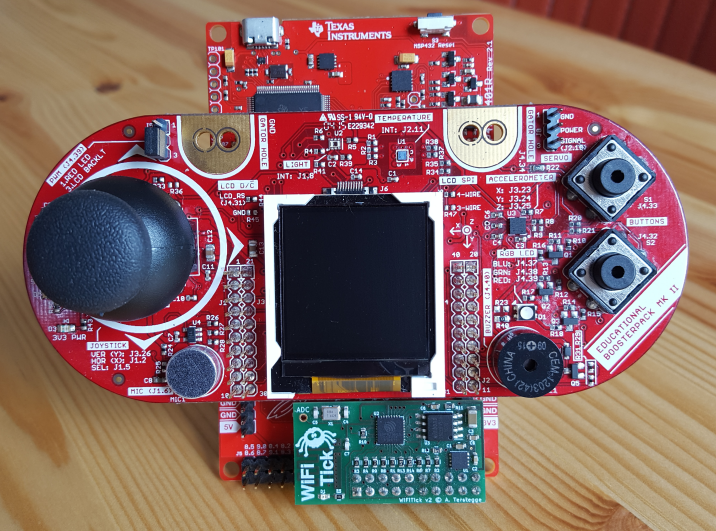
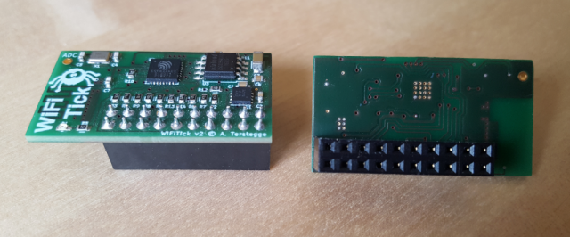

# WiFiTick
Small ESP8266-based WLAN board for the MSP432 launchpad.

Here you see WiFiTick attached to the MSP432 launchpad with an
additional EDU MKII booster pack above:

WiFiTick front and back view:

Texas Instruments have their own WiFi solution (e.g. the CC3100 booster pack).
But these boards have to be disconnected from the lauchpad when you want to 
flash a new firmware to the WiFi board. This makes it a little bit unhandy for
students.

WiFiTick has the following features:

* Low cost - ideal for student projects
* 4 MiB flash, so lots of space for ESP8266 programs and SPIFFS 
* Integrated PCB antenna
* Single 5V power supply (via USB/launchpad). There is a separate
  3.3V regulator on the board.
* No interference with other booster packs, because the additional 
  horizontal header of the MSP432 lauchpad is used
* No need to disconnect from launchpad: With a special software, the MSP432
  launchpad serves as a programming adapter (via a UART interface). This
  software features automatic baud rate control, so boot messages of the
  ESP8266 are readable.
* Easy programming of ESP8266 with Arduino IDE
* Full control of the ESP8266 from MSP432 side. The MSP432 can ...
    * Reset, Power up/down or wake up the ESP8266
    * Communicate with the ESP8266 via SPI (or any other protocol -
      there are 8 GPIOs plus the programming UART available for
      data exchange).
* Additional ADC input pad for the ESP8266
* User-controllable LED on the board (can e.g. simulate the behaviour of the
  LED on the well-known ESP-12E/F boards)

This project contains the hardware design files, which were developed
using [KiCad EDA](http://kicad-pcb.org/). The related software will be
published in a separate project.

